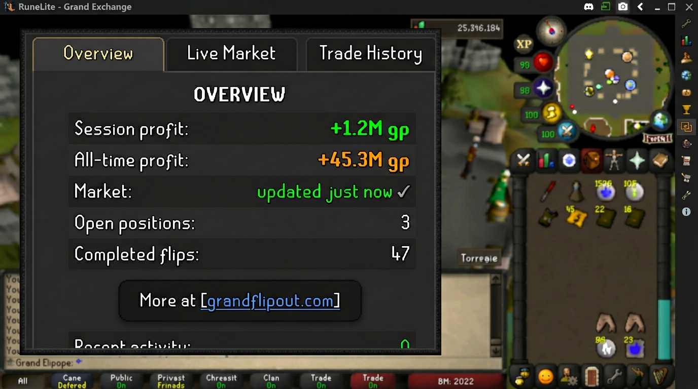

# Grand Flip Out

A RuneLite plugin that helps you flip smarter on the Grand Exchange: live market data and ranked opportunities from our API, plus your own trade history and profit tracking that never leaves your PC.

**What it does:** You connect the plugin to your Grand Flip Out account (one API key). You get live buy/sell prices and a ranked list of flip opportunities—low risk, high volume, or high margin, depending on how you like to trade. Your actual buys and sells are tracked locally: session profit, all-time profit, open positions, and a full flip log. Export or clear your data whenever you want. No automation, no sketchy stuff—just numbers and history so you can see how you’re doing.

<!-- Add a real screenshot: ./gradlew run, open the panel, PrtSc, save to screenshots/ -->
<!--  -->

**Compliance:** Built to stay within RuneLite and Jagex rules. Analysis and UI only; your key is stored as a secret in config. This plugin was started from the official RuneLite plugin example; all Grand Flip Out code is original (no code from other plugins). See [Originality and attribution](docs/ORIGINALITY_AND_ATTRIBUTION.md). We do not hide what the plugin does.

---

## What you need to get started

1. **An API key** — Sign up at [grandflipout.com](https://grandflipout.com) (or your deployed site), log in, and create an API key. Copy it once; the dashboard won’t show it again.
2. **Plugin config** — In RuneLite, open the config (wrench icon), find **Grand Flip Out API**, and paste your Server URL (e.g. `https://grandflipout.com`) and API Key. In **Grand Flip Out**, turn on “Enable market API polling” and “Enable local trade tracking” if you want live data and history.
3. **Use the panel** — Open the Grand Flip Out panel from the sidebar. Overview shows your session and all-time profit; Live Market shows prices and opportunities; Trade History shows your trades, positions, and flip log.

That’s it. Your trade data stays on your machine unless you export it.

---

## Features (the short version)

- **Live market & opportunities** — Prices and a ranked opportunity list from the API. Pick a strategy (default, low risk, high volume, high margin) in config.
- **Local tracking** — Every GE buy/sell you do is recorded. Session and all-time P/L, open positions, profit by item, flip log. Persists across restarts if you leave the option on.
- **Hotkeys** — Optional: cycle tabs, start a new session, refresh the panel. Set them in config.
- **Alerts** — Optional desktop notifications when a high-confidence opportunity shows up (margin and confidence thresholds in config).
- **Export/import** — Copy or save your trade history and flip logs as JSON or CSV. Paste or load from file to restore.

---

## Docs (for setup and submission)

| Doc | What it’s for |
|-----|----------------|
| [API contract](docs/API_CONTRACT.md) | What the plugin expects from your API (market + opportunities). |
| [Compliance](docs/COMPLIANCE.md) | How we stay within RuneLite/Jagex policy. |
| [Deploy (Railway + Cloudflare)](docs/DEPLOY_RAILWAY_CLOUDFLARE.md) | Hosting the API and site. |
| [Compliance checklist](docs/COMPLIANCE_CHECKLIST.md) | Pre-submission policy and hub checklist. |
| [How to submit to the Plugin Hub](docs/HOW_TO_SUBMIT.md) | Plain-language steps so you can submit it yourself. |
| [Manual QA](docs/QA_MANUAL_TEST.md) | Things to test before release. |
| [Originality and attribution](docs/ORIGINALITY_AND_ATTRIBUTION.md) | How the project was started; confirms all code is original. |
| [Account linking & compliance](docs/ACCOUNT_LINKING_AND_COMPLIANCE.md) | How users link (email + API key); compliant, no game credentials. |
| [Payments](docs/PAYMENTS.md) | How to accept payment (Stripe) and receive payouts. |
| [Discord](docs/DISCORD.md) | Set your Discord invite link; optional bot for community. |
| [Before you release](docs/BEFORE_RELEASE.md) | Single checklist for author, screenshot, deploy, Discord, Stripe. |
| [Submit day runbook](docs/SUBMIT_DAY_RUNBOOK.md) | Exact launch/submission order so nothing is missed. |

---

## Build and run (developers)

```bash
./gradlew compileJava
./gradlew run
```

The **server** (Node.js) and **website** live in `server/` and `website/`. Run the server with `cd server && npm install && npm run dev` to test signup, login, and API keys locally. Deploy to Railway (and optionally Cloudflare) when you’re ready—see the deploy doc.

Before release, run:
- `scripts/check-local-build-alignment.ps1` to verify your pinned `runeLiteVersion` matches your local RuneLite client build.
- `scripts/publish-preflight.ps1` for an all-in-one release check (build/tests, metadata sanity, screenshot check, placeholder scan, and Railway env presence checks).
- `scripts/replace-discord-invite.ps1 -InviteUrl "https://discord.gg/yourInviteCode"` to replace website Discord placeholders in one command.
- `scripts/check-infra.ps1` to validate Railway deployment status, Cloudflare edge response, and DNS for apex + `www`.
- `scripts/smoke-prod.ps1` to run a full live smoke test (signup/login/keys/market/opportunities/checkout-config).
- `scripts/set-stripe-vars.ps1` to safely set Stripe vars on Railway from CLI without printing secrets.
- `scripts/get-www-dns-target.ps1` to print the exact CNAME value Railway expects for `www.grandflipout.com`.
- `scripts/go-live-status.ps1` to run preflight + infra + smoke in one command and print remaining launch tasks.
- `scripts/operator-launch.ps1` to apply Discord/Stripe settings (if provided) and then run full go-live checks.

---

## Quick config reference

- **Grand Flip Out** — Enable/disable API polling and local tracking; poll interval; opportunity strategy; hotkeys; alert thresholds.
- **Grand Flip Out API** — Server URL, API key (masked), and endpoint paths. Get your key from the website.

---

## A few notes

- The plugin only displays data and records GE events. It doesn’t click, move, or automate anything.
- Your API key is stored locally and masked in the config UI. We don’t log it.
- If something’s wrong with the API (auth, network, server), the panel will say so. No silent failures.
